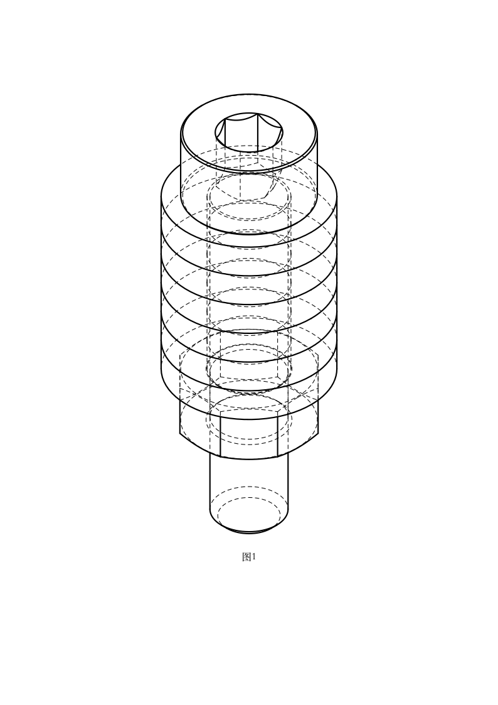

# 多图元装配端到端 QA 报告

- 日期：2026-08-04
- 测试方式：gstack QA + FastAPI 真实接口 + OpenCascade B-Rep/STEP 回读
- 测试规模：75 组提示词、每组 6–10 个图元
- 测试对象：ISO 4762 / GB/T 70.1 M4 螺钉、M4 平垫圈、ISO 4032 M4 六角螺母
- 结论：通过

## 1. 提示词

完整 75 组提示词及逐条预期图元清单见：

- [`assembly-prompts-over-5-components-2026-08-04.json`](assembly-prompts-over-5-components-2026-08-04.json)

覆盖矩阵：

| 维度 | 覆盖范围 |
|---|---|
| 螺钉长度 | M4×8、M4×10、M4×12、M4×16、M4×20 |
| 重复垫圈数量 | 4、5、6、7、8 个 |
| 总实例数 | 6、7、8、9、10 个 |
| 描述形式 | 中文、英中混合、ISO/GB/T 混合、`×`/`x`/`*`、数量前置/后置 |

代表性提示词：

1. 6 图元：`生成一套 6 图元 M4 紧固组件：1 个 ISO 4762 M4×8 内六角圆柱头螺钉、4 个 M4 平垫圈和 1 个 M4 六角螺母，按轴向顺序装配。`
2. 8 图元：`生成一套 8 图元 M4 紧固组件：1 个 ISO 4762 M4×20 内六角圆柱头螺钉、6 个 M4 平垫圈和 1 个 M4 六角螺母，按轴向顺序装配。`
3. 10 图元：`装配 ISO 4762 / GB/T 70.1 M4x20 内六角螺钉 1 个，M4 flat washer 8 个，M4 hex nut 1 个；共 10 件并同轴贴合。`
4. 语序摩擦：`需要 1 件 GB/T 70.1 M4*16 内六角圆柱头螺钉；7 枚 M4 平垫；1 枚 M4 六角螺母。请按螺钉→垫圈→螺母形成 9 图元装配。`

## 2. 模型截图

### 2.1 修复前：8 图元请求被截断为 5 个


### 2.2 修复后：完整识别 8 个实例


### 2.3 8 图元装配轴测附图



图中结构自上而下为螺钉头部、6 个连续平垫圈、六角螺母及螺钉杆部。该附图直接由与 STEP 导出相同的装配 B-Rep 投影生成。

### 2.4 浏览器生成完成状态


无头 Chromium 环境不提供 WebGL，因此 3D 面板进入预期的降级状态；附图、合规检查、YAML 和 STEP 下载仍正常。几何正确性由 STEP 回读和 B-Rep 检查验证，不依赖 WebGL 截图。

## 3. 一致性验证

### 3.1 提示词到图元匹配

| 检查项 | 结果 |
|---|---:|
| 提示词总数 | 75 |
| 图元 ID 完全一致 | 75/75 |
| 实例数量完全一致 | 75/75 |
| 图元顺序完全一致 | 75/75 |
| 静默截断 | 0 |
| `M4` 中数字误判为数量 | 0 |

8 图元代表用例解析结果：

```text
gbt70-1-shcs-m4-l0020
flat-washer-normal-m4-simple × 6
iso4032-hex-nut-m4
```

### 3.2 装配端口与实例变换

装配规则：

```text
螺钉.head_bearing_face
  ← 垫圈1.face_a
垫圈1.face_b ← 垫圈2.face_a
垫圈2.face_b ← 垫圈3.face_a
垫圈3.face_b ← 垫圈4.face_a
垫圈4.face_b ← 垫圈5.face_a
垫圈5.face_b ← 垫圈6.face_a
垫圈6.face_b ← 螺母.face_a
```

解析后的 Z 轴实例位置：

```text
[0.0, -0.9, -2.7, -4.5, -6.3, -8.1, -9.9, -14.001328] mm
```

25 种唯一规格组合全部满足：首个垫圈连接螺钉承压面；后续垫圈和螺母逐级连接前一实例的 `face_b`；没有跳号、丢实例或端口回退。

### 3.3 几何与 STEP 一致性

8 图元代表模型测量结果：

| 指标 | 结果 |
|---|---:|
| B-Rep 有效 | 是 |
| 实体干涉 | 无 |
| Solid 数 | 8 |
| Shell 数 | 8 |
| Face 数 | 74 |
| Edge 数 | 305 |
| 包围盒 | 9 × 9 × 24 mm |
| 体积 | 1000.180995 mm³ |
| 表面积 | 1650.084282 mm² |
| 相邻端面最小间隙 | 0–0.001328 mm |

6、8、10 图元代表用例均完成 `/api/generate`、STEP 下载和 ISO-10303-21 文件头回读。导出前后的实例数、图元顺序和实体数量一致。

### 3.4 XCAF 语义装配一致性

| 用例 | 唯一定义数 | 实例数 | 结果 |
|---|---:|---:|---|
| 6 图元 | 3 | 6 | 通过 |
| 8 图元 | 3 | 8 | 通过 |
| 10 图元 | 3 | 10 | 通过 |

三个唯一定义分别为螺钉、平垫圈和六角螺母；重复垫圈使用实例复用，没有被错误合并为单一实例。

## 4. 修复记录

| 提交 | 修复内容 |
|---|---|
| `72d4e6a` | 推荐容量由 5 提升至 32，防止大型装配静默截断 |
| `f19c9a6` | 修复数量前置/后置解析及 `M4` 数字误判，加入 75 组压力集 |
| `126c35e` | 更新前端资源版本，避免浏览器继续运行旧的五图元脚本 |
| `bedcccb` | 统一装配标题、附图语义、参数摘要及实例/Solid/XCAF 数量门禁 |
| `04ef334` | 生成前增加当前描述的图元推荐同步屏障 |
| `d51075b` | 消除点击生成时 blur 与 500ms 防抖互相中止的竞态 |
| `f55abc8` | 发布完成竞态修复的前端资源版本 |

## 5. 残余问题复测

最初浏览器流程中，页面虽然显示“已推荐 8 个图元”，但点击生成时输入框 `blur` 会清空推荐，再由尚未完成的防抖任务中止同步请求，最终提交空 `component_ids` 并退回丝杠生成路线。

修复后的真实任务 `c2664e46-564f-4c7d-96cd-2db1943ebfeb` 记录为：

```text
提交 component_ids: 8
返回标题: 紧固组件技术附图
assembly_report.instances: 8
B-Rep solids: 8
XCAF instances: 8
assembly_kind: fastener_stack
unique_components: 3
浏览器控制台错误: 0
```

这证明最终生成动作使用的是页面展示的 8 个推荐实例，而不是仅在选择界面显示、提交时丢失。

## 6. 剩余能力边界

| 能力 | 当前状态 | 边界/行为 |
|---|---|---|
| M4 线性紧固栈 | 已验证 | 1 个 ISO 4762/GB/T 70.1 螺钉 + 4–8 个平垫圈 + 1 个 ISO 4032 螺母，6–10 实例 |
| 重复图元实例复用 | 已验证 | XCAF 保留全部实例，重复垫圈复用同一定义 |
| 描述触发重新推荐 | 已验证 | input 防抖、blur 和点击生成均同步到当前描述 |
| 最大推荐/生成规模 | 接口支持，未全量压测 | 上限 32 个实例；本报告的几何压力上限为 10 个 |
| M2/M2.5/M3/M5/M6/M8/M10/M12 紧固栈 | 图元存在，装配未覆盖 | 需要补齐对应垫圈/螺母的确定性规格映射与同等压力集 |
| 弹簧垫圈、隔离柱、沉头/圆头螺钉 | 图元存在，规则部分覆盖 | 尚未定义所有混合堆叠的承压面方向、压缩量和合法顺序 |
| 轴—轴承—联轴器 | 基础规则已存在 | 本报告未重新验证多轴同心、过盈/间隙配合和轴向定位组合 |
| 齿轮、同步带、链轮传动 | 尚未形成完整闭环 | 需要节圆/中心距、啮合相位、张紧和多分支约束求解器 |
| 支架、型材和空间分支装配 | 尚未形成完整闭环 | 当前自动 manifest 主要是线性相邻连接，不支持通用装配图求解 |
| 参考图视觉还原评分 | 可用但非本报告重点 | 本报告验证 B-Rep 投影一致性，没有给出外部参考图相似度目标 |
| WebGL 交互预览 | 环境受限 | 当前 gstack Chromium 无 WebGL；系统会降级，STEP、SVG、PNG 不受影响 |
| 非法或缺端口组合 | 会在导出前失败 | 不会自动猜测未知端口；需要新增图元端口或明确装配规则后再生成 |

通过率只适用于本报告明确列出的 75 条 M4 提示词和 25 种唯一线性紧固组合，不能外推为任意图元、任意拓扑装配均已达到同等稳定性。

## 7. 最终结论

本轮覆盖范围内，提示词、推荐图元、assembly manifest、实例变换、B-Rep、附图、STEP 和 XCAF 装配树已经形成一致闭环。系统能够稳定处理 6–10 个实例以及重复图元，错误组合会在导出前经过端口、B-Rep 和干涉门禁。

报告中的模型截图、实例变换和一致性数字均来自残余竞态修复后的最终任务。
